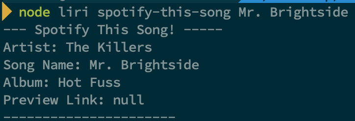
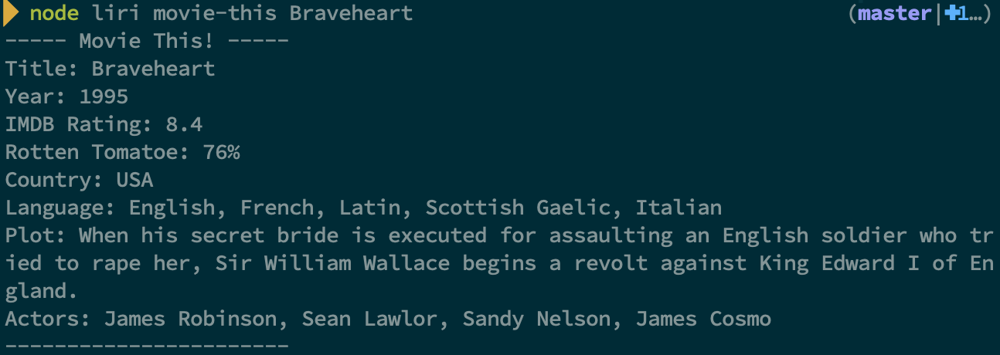
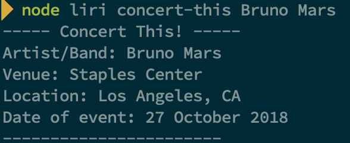
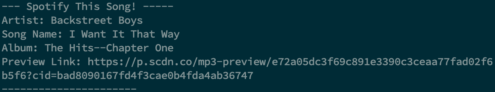

# LIRI NodeJS App
LIRI is here to help!

She can search for:

* Spotify Songs
* Concerts of your favorite bands or artist
* All the info of your favorite movie

All this from your terminal!

## How to use this amazing app

* Clone the repo
* run npm install
* node liri -command
    * spotify-this-song artist
    * movie-this movie-name
    * concert-this band/artist
    * do-what-it-says

## Screenshots
### Spotify This!

### Movie This!

### Concert This!

### Do what it says!

## Video

<iframe width="560" height="315" src="https://www.youtube.com/embed/MrxVhniT-j4" frameborder="0" allow="autoplay; encrypted-media" allowfullscreen></iframe>